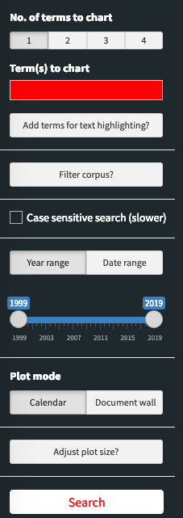
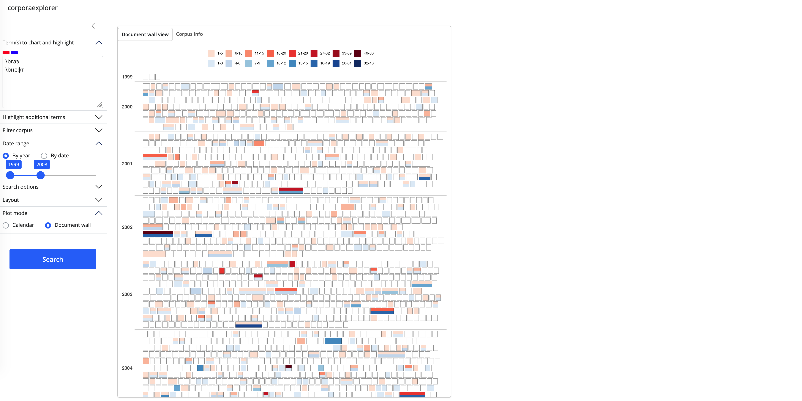
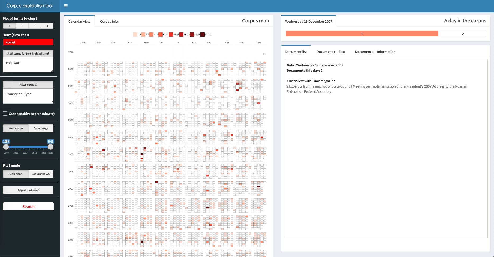
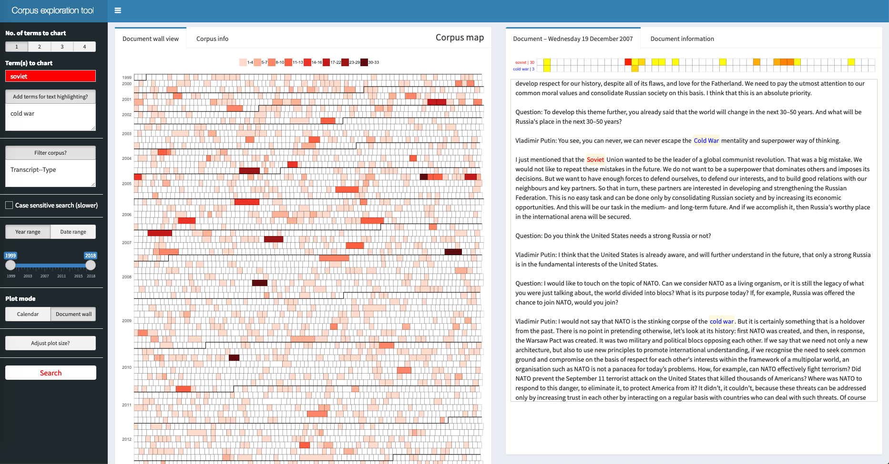

---
output:
    github_document
---

<!-- README.md is generated from README.Rmd. Please edit that file -->

```{r setup, include = FALSE}
knitr::opts_chunk$set(
  collapse = TRUE,
  comment = "#>",
  fig.path = "man/figures/README-",
  out.width = "100%"
)
```
# corporaexplorer

<!-- badges: start -->
[](https://www.gnu.org/licenses/gpl-3.0)
[](https://travis-ci.org/kgjerde/corporaexplorer)
[](https://ci.appveyor.com/project/kgjerde/corporaexplorer)
[](https://doi.org/10.21105/joss.01342)
<!-- badges: end -->


**corporaexplorer** is an R package that uses the `Shiny` graphical user interface framework for dynamic exploration of text collections.

**corporaexplorer** is designed for use with a wide range of text collections; one example could be a collection of tens of thousands of documents scraped from a governmental website; another example could be the collected works of a novelist; a third example could be the chapters of a single book.

**corporaexplorer**'s intended primary audience are qualitatively oriented researchers who
rely on close reading of textual documents as part of their academic activity,
but the package should also be a useful supplement for those doing quantitative textual research and wishing to visit the texts under study.
Finally, by offering a convenient way to explore any character vector, it can also be useful for a wide range of other R users.

While collecting and preparing the text collections to be explored requires some familiarity with R programming, using the Shiny apps for exploring and extracting documents from the corpus should be fairly intuitive also for those with no programming knowledge, once the apps have been set up by a collaborator. Thus, the aim is for the package to be useful for anyone with a rudimentary knowledge of R -- or with collaborators who have such knowledge.


## Installation

To install **corporaexplorer**, run the following from an R console:

``` r
install.packages("devtools")
devtools::install_github("kgjerde/corporaexplorer")
```

*Note to developers:
The package's internal test suite uses the [`shinytest`](https://github.com/rstudio/shinytest) package,
which requires that [`PhantomJS`](http://phantomjs.org/) is installed.
This can be done through the `shinytest::installDependencies()` function.*


## Example use cases and example corpora

### A. Date-based corpora

For many qualitatively oriented researchers, a typical workflow includes analysing a set of texts downloaded from a website based on keyword search in the website's internal search engine.

**corporaexplorer** aims to enhance such workflows in several ways.
The package makes it easier to interact with larger text collections than what is usually feasible,
and it facilitates creativity by allowing for more open-ended explorations of the text collections.
Further, it can make selection and extraction of texts for further scrutiny faster than a "traditional workflow" allows,
and it facilitates transparency and rigidity by making it easier to account for or reproduce the process of selecting texts for close reading.
Above all, the package is aimed at flexibility: it does not enforce any given workflow, but can play a small or larger role in many different research designs.

Example corpora and use cases include:

* **Text collections that can be freely shared**, e.g. collections of government statements and transcripts scraped from the US State Department or the Russian President's website. Such documents are usually equipped with a Creative Commons license or similar. Example use case: a close reading of official Russian discourse on NATO.
* **Text collections that cannot be freely shared**, e.g. a collection of
newspaper articles etc. retrieved from a database.
* **Personal text collections**: any collection of texts that are meaningful to explore with a time aspect.

The package includes a tiny "corporaexplorerobject" (see below): `corporaexplorer::test_data`, which consists of 10 tiny documents and can be used for testing the basic functionality of the package.

A more typical corpus can be downloaded for testing
[here](https://ndownloader.figshare.com/files/14626970?private_link=820c105c12755d853801)
-- this is a "corporaexplorerobject" based on a document collection scraped from the Russian governmental website kremlin.ru (7751 documents, more info [here](https://figshare.com/s/820c105c12755d853801)).
The equivalent material in Russian (10,221 documents) can be downloaded [here](https://figshare.com/s/be0d2cfa195e43160fcb).
A third, somewhat bigger (but less carefully prepared) test corpus (26,654 documents) from the same website is available [here](https://figshare.com/s/fcd93f6f93bb23be3bb1).<sup>[1](#footnote1)</sup>


### B. Text collections that are not organised by date

Not all corpora are organised by date,
and it is easy to create a "corporaexplorerobject"
from a corpus with a different structure,
for example a collection of books, each organised in chapters
-- or just from a sequence of texts.

See [here](examples/bible.md) for an example of how **corporaexplorer** can be used to explore the Bible,
and [here](examples/jane_austen.md) for a starter on how to explore Jane Austen's novels.


## Functions

**corporaexplorer** contains three main functions:

1. `prepare_data()` converts a data frame to a "corporaexplorerobject".
2. `run_corpus_explorer()` runs the package's core feature, a Shiny app for fast and flexible
exploration of a "corporaexplorerobject".
3. `run_document_extractor()` runs a Shiny app for simple retrieval/extraction of
documents from a "corporaexplorerobject" in a reading-friendly format.


## 1. Prepare data for the Shiny apps

The `prepare_data()` function returns a "corporaexplorerobject" that can be explored in the package's two Shiny apps.

The three most important arguments are:

* `dataset`: a data frame with, as a minimum, a `Text` column. If `date_based_corpus` is `TRUE` (the default), dataset must also contain a column "Date" (of class Date).
* `date_based_corpus`. Default is `TRUE`. Set to `FALSE` if the corpus is not to be organised according to document dates.
* `grouping_variable`. If date_based_corpus is TRUE, this argument is ignored. If date_based_corpus is FALSE, this argument can be used to group the documents, e.g. if `dataset` consists of chapters belonging to different books, and the book indicated in a "Book" column,
set this argument to `"Book"`.

The rest of the arguments can be used to fine-tune the presentation of the corpora in
the **corporaexplorer** apps.

`prepare_data` can also be run with a character vector as only argument.
In this case the function will return a simple "corporaexplorerobject"
with no metadata.

After installing **corporaexplorer**, run the following in the R console
to see full documentation for the `prepare_data()` function.

``` r
library(corporaexplorer)
?prepare_data
```

## 2. The corpus exploration app
Start the app by running the `run_corpus_explorer()` function with a
"corporaexplorerobject" created by `prepare_data()` as argument.
Run the following in the R console to see documentation for the `run_corpus_explorer()` function.

``` r
library(corporaexplorer)
?run_corpus_explorer
```

The default arguments are recommended for most use cases.

While it should be possible to use the app without reading any further, the rest of this section includes
user interface instructions as well as some details about the app's inner workings
that are relevant for advanced users. A date-based corpus is used as example.

### 2a. Sidebar input



* **Number of terms to chart**: How many terms (phrases/patterns) should be charted in the corpus map? Current maximum is five.
* **Term(s) to chart**: Using colour fillings, the corpus map plot will indicate days/documents where these terms are present. The terms will also be highlighted in all documents.
* **Additional terms for text highlighting**: Terms included here (one on each line) will be highlighted in all documents. An arbitrary number of terms can be added.
* **Filter corpus?** Input terms here (one on each line) will filter the corpus so that it includes only documents where all these terms are present. Unlike terms entered in the two fields above, these terms will not be included in the summary statistics in the "Corpus info" tab. An arbitrary number of terms can be used.
* **Case sensitive search**: Check this box to distinguish between lower and upper case in the search. Unchecked, `war` will find both "war" and "War"; if checked, `war` will only find "war".
* **"Year range" or "date range"**: Filters the corpus (the first and last date included) by time span. (Only for date-based corpora.)
* **Plot mode ("calendar" or "document wall")**: Should the resulting corpus map treat one day or one document as its base unit? (Only for date-based corpora.)
* **Adjust plot size**: Change plot height. This is the only sidebar input that has effect without clicking the search button.
* **Search button**: Only when search button is clicked will input from the sidebar (with the exception  of the "Adjust plot size" input) be handled by the app.

#### Note: Text input -- regular expressions

All text input will be treated as regular expressions (or *regexes*).
Regular expressions can be very powerful for identifying exactly the
text patterns one is interested in, but this power comes at a high complexity cost.
That said, for simple searches that do not include punctuation, all
one needs to know is basically this:

* `\b` in a search means the beginning or the end of a word.
* `.` in a search means "any single character".

Thus, (in a case insensitive search):
``` r
arctic  # will match both "Arctic" and "Antarctic"
\barctic  # will match only "Arctic"

civili.ation  # will match both "civilisation" and "civilization"
```

For more about regex syntax and the regex flavours available, see the section about regex engines [below](#advanced-detail-regular-expression-engines).

(N.B. As seen in the example, a single backslash (not a double backslash as in the R console)
is used as escape character. For example will `\.` match a literal ".", and `\d` match any digit.)

#### Note: Additional search arguments

**corporaexplorer** offers two optional arguments that can be used separately or together by adding them to the end of a search pattern (with no space between):

1. The "threshold argument" has the syntax `--threshold` and determines the minimum
number of search hits a day/document should contain in order to be coloured in the corpus map:
``` r
Russia--10  # Will find documents that includes the pattern "Russia" at least 10 times.
```

2. The "column argument" has the syntax `--column_name` and allows for searches in other columns than the default full text column:
``` r
Russia--Title  # Will find documents that has the pattern "Russia" in its "Title" column.
```

3. The two arguments can be combined in any order:
``` r
Russia--2--Title
Russia--Title--2
# Will both find documents that includes the pattern "Russia" at least 2 times
# in the Title column.
```

These arguments have the following consequences:

* *If used in the "Term(s) to chart" fields*: The corpus map plot will use colour fillings to indicate days/documents that satisfy the search arguments. Likewise, the summary statistics displayed in the "Corpus info" tab will be based on the documents matching the search arguments. In the documents themselves, all pattern matches will be highlighted. For example, a search for `Russia--Title` will in the corpus map plot colour only documents with the pattern Russia in the Title column, but the pattern Russia will be highlighted in all documents.
* *If used in the "Add terms for highlighting" field*: The pattern will be highlighted in all documents. The summary statistics displayed in the "Corpus info" tab will be based on the documents matching the search arguments.
* *If used in the "Filter corpus" field*: The corpus will be filtered to include only documents that match the search arguments.

### 2b. Corpus map

The result of the search is an interactive heat map, a **corpus map**, where the filling indicates how many times the search term is found (legend above the plot).

In the **calendar view** (only for date-based corpora), each tile represents a day, and the filling indicates how many times the search term is found in the documents that day:

```{r, out.width = "80%", echo = FALSE}
knitr::include_graphics("man/figures/first_search.png")
```

<br>

In the **document wall view**, each tile represents one document, and the filling indicates how many times the search term is found in this document:

```{r, out.width = "80%", echo = FALSE}

```

<br>

The **Corpus info** tab presents some very basic summary statistics of the search results.
(Look at e.g. [`quanteda`](https://github.com/quanteda/quanteda) and [`tidytext`](https://github.com/juliasilge/tidytext)
for excellent R packages for *quantitative* text analysis. Using such packages
together with **corporaexplorer** is highly recommended in order to combine qualitative
and quantitative insights.)

Clicking on a tile in the corpus map opens the **document view** to the right of the corpus map.

### 2c. Document view

**When in calendar view**: Clicking on a day creates a second heat map tile chart where one tile is one document,
and where the colour in a tile indicates how many times the search term is found in the document.
In the box below is produced a list of the title of the documents this day.

```{r, out.width = "80%", echo = FALSE}

```

<br>

Clicking on a "document tile" produces two things. First, the full text of the document with search terms highlighted. Second, above the text a tile chart consisting of n tiles where each tile represents a 1/n part of the document, and where the colour in a tile indicates whether and how many times the search term is found in that part of the document. Clicking on a tile scrolls the document to the corresponding part of the document.<sup>[2](#footnote2)</sup>

```{r out.width="80%", echo=FALSE}

```


**When in document wall view**: Clicking on a tile in the corpus map leads straight to the relevant document.

### 2d. Advanced detail: Regular expression engines

`run_corpus_explorer()` lets you choose among three regex engine setups:

1. `default`: use the [`re2r`](https://github.com/qinwf/re2r) package for simple searches and the [`stringr`](https://github.com/tidyverse/stringr) package for complex regexes (details below).
This is the recommended option.
2. use `stringr` for all searches.
3. use `re2r`for all searches.  

`re2r` is very fast but has a more limited feature set than `stringr`, especially
in handling non-ASCII text, including word boundary detection.
With the `default` option, the `re2r` engine is run when no special regex characters are used;
otherwise `stringr` is used. This option should fit most use cases.

Please consult the documentation for [`re2r`](https://github.com/qinwf/re2r) and
[`stringr`](https://github.com/tidyverse/stringr) for full information about syntax flavours.

By default, searches for patterns consisting of a single word and without special characters will be carried out in a document term matrix. Other searches are carried out in full text.

Advanced users can set the `optional_info` parameter in `run_corpus_explorer()` to `TRUE`:
this will print to console the following information for each input term:
which regex engine was used,
and whether the search was carried out in the document term matrix or in the full text documents.

## 3. The download documents app

This app is a simple helper app to retrieve a subset of the corpus in a format suitable for close reading.

```{r out.width="80%", echo=FALSE}
knitr::include_graphics("man/figures/download_tool.png")
```

Start the app by running the `run_document_extractor()` function with a
"corporaexplorerobject" created by `prepare_data()` as argument.
Run the following in the R console to see documentation for the `run_document_extractor()` function.

``` r
library(corporaexplorer)
?run_document_extractor
```

### 3a. Sidebar input

* **Term(s) to highlight**: An arbitrary number of search terms (regular expressions)
that will be highlighted in the documents in the produced HTML reports.
* **Filter corpus?**: Input terms here (one on each line) will filter the corpus so that it includes only documents where all these terms are present. Unlike terms entered in the two fields above, these terms will not be included in the summary statistics in the "Corpus info" tab. An arbitrary number of terms can be used.
* **Case sensitive search**: Check this box to distinguish between lower and upper case in the search. Unchecked, `war` will find both "war" and "War"; if checked, `war` will only find "war".
* **"Year range" or "date range"**: Filters the corpus (the first and last date included).

By default, there is an upper limit
of 400 documents to be included in one report (can be changed in the
`max_html_docs` parameter in `run_document_extractor()`).


### 3b. Advanced detail: Regular expression engines

Speed is considered to be of less importance in this app, and all searches
are carried out as full text searches with `stringr`. Again, note that a single backslash is used as escape character. For example will `\.` match a literal ".", and `\d` match any digit.


## A note on platforms and encoding

**corporaexplorer** works on Mac OS, Windows and Linux,<sup>[3](#footnote3)</sup>
and there are some important differences in how R handles text
on the different platforms.
If you are working with plain English text,
there will most likely be no issues with encoding on any platform.
Unfortunately, working with
non-[ASCII](https://en.wikipedia.org/wiki/ASCII) encoded text in R
(e.g. non-English characters), *can* be complicated -- in particular on Windows. 

**On Mac OS or Linux**, problems with encoding will likely not arise at all.
If problems do arise, they can typically be solved by
making the R "locale" unicode-friendly (e.g. `Sys.setlocale("LC_ALL", "en_US.UTF-8")`).
NB! This assumes that the text is UTF-8 encoded,
so if changing the locale in this way does not help,
make sure that the text is encoded as UTF-8 characters.
Alternatively, if you can ascertain the character encoding, set the locale correspondingly.

**On Windows**, things can be much more complicated.
The most important thing is to check carefully that
the texts appear as expected in `corporaexplorer`'s apps,
and that the searches function as expected.
If there are problems, a good place to start is a
blog post with the telling title
["Escaping from character encoding hell in R on Windows"](https://dss.iq.harvard.edu/blog/escaping-character-encoding-hell-r-windows).

For (a lot) more information about encoding, see
[this informative article](http://kunststube.net/encoding/)
by David C. Zentgraf.


## How to cite

Gjerde, Kristian Lundby. 2019. "corporaexplorer: An R package for dynamic exploration of text collections." _Journal of Open Source Software_ 4 (38): 1342. [https://doi.org/10.21105/joss.01342](https://doi.org/10.21105/joss.01342).

For a BibTeX entry, use the output from `citation(package = "corporaexplorer")`.


## Contributing

Contributions in the form of feedback, bug reports and code are most welcome. Ways to contribute:

*  Contact [the maintainer](mailto:klg@nupi.no) by email.
*  Issues and bug reports: [File a GitHub issue](https://github.com/kgjerde/corporaexplorer/issues).
*  Fork the source code, modify, and issue a [pull request](https://help.github.com/articles/creating-a-pull-request-from-a-fork/) through the [project GitHub page](https://github.com/kgjerde/corporaexplorer).

<hr>

<a name="footnote1">*1</a>. All this material is licensed under Creative Commons Attribution 4.0 International (CC BY 4.0).*  
<a name="footnote2">*2</a>. Using the [`jquery.scrollTo`](https://github.com/flesler/jquery.scrollTo) plugin.*  
<a name="footnote3">*3</a>. That said, the package is developed on Mac OS, and the Shiny apps' user interface is rather clunkier on Windows.*
